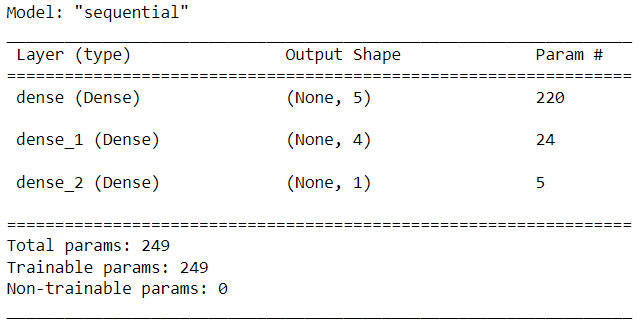
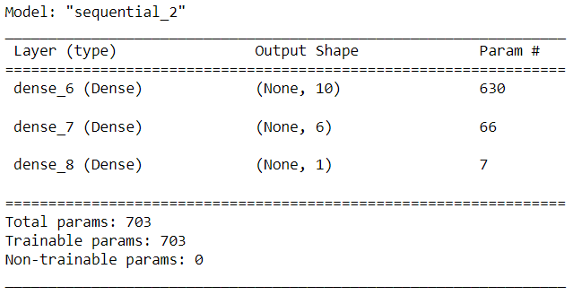
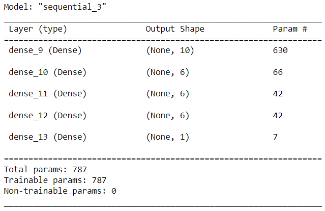
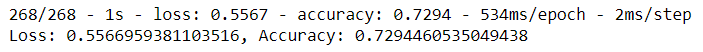
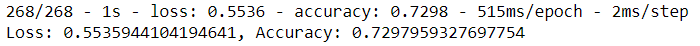
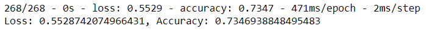
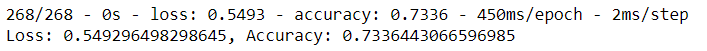
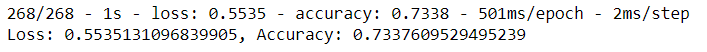

# Neural_Network_Charity_Analysis

## Overview of Analysis

### Purpose

The purpose of this analysis is to create a binary classifier that is capable of predicting whether applicants will be successful if funded by Alphabet Soup.

## Results

### Data Preprocessing

* **Target variable:** The model used the _IS_SUCCESSFUL_ column to train and predict success.
* **Features:** The following columns were used as features:
    - _APPLICATION_TYPE_: Binned rarities, encoded using OneHot
    - _AFFILIATION_: Encoded using OneHot
    - _CLASSIFICATION_: Binned rarities, encoded using OneHot
    - _USE_CASE_: Encoded using OneHot
    - _ORGANIZATION_: Encoded using OneHot
    - _STATUS_
    - _INCOME_AMT_: Encoded using OneHot
    - _SPECIAL_CONSIDERATIONS_: Encoded using OneHot
    - _ASK_AMT_
* **Removed variables:** Columns that contained only unique values including _EIN_ and _NAME_ were removed.

### Compiling, Training, and Evaluating the Model

#### Initial Model (Two hidden layers, 100 epochs)

```
number_input_features = len(X_train.iloc[0])
hidden_nodes_layer1 =  5
hidden_nodes_layer2 = 4

nn = tf.keras.models.Sequential()

nn.add(tf.keras.layers.Dense(units=hidden_nodes_layer1, input_dim=number_input_features, activation="relu"))
nn.add(tf.keras.layers.Dense(units=hidden_nodes_layer2, activation="relu"))
nn.add(tf.keras.layers.Dense(units=1, activation="sigmoid"))
```



##### First Hidden Layer

* **Neurons:** 5
* **Activation Function:** ReLu

##### Second Hidden Layer

* **Neurons:** 4
* **Activation Function:** ReLu

##### Output Layer

* **Neurons:** 1
* **Activation Function:** Sigmoid

#### Optimized Model 1 (Two hidden layers, 100 epochs)

The same model structure from the initial model was used with the _ASK_AMT_ column categorized and rarities binned.

```
number_input_features = len(X_train.iloc[0])
hidden_nodes_layer1 =  5
hidden_nodes_layer2 = 4

nn = tf.keras.models.Sequential()

nn.add(tf.keras.layers.Dense(units=hidden_nodes_layer1, input_dim=number_input_features, activation="relu"))
nn.add(tf.keras.layers.Dense(units=hidden_nodes_layer2, activation="relu"))
nn.add(tf.keras.layers.Dense(units=1, activation="sigmoid"))
```


##### First Hidden Layer

* **Neurons:** 5
* **Activation Function:** ReLu

##### Second Hidden Layer

* **Neurons:** 250
* **Activation Function:** ReLu

##### Output Layer

* **Neurons:** 1
* **Activation Function:** Sigmoid

#### Optimized Model 2 (Two hidden layers, 100 epochs)

The same model structure from optimization model 1 was used with twice as many neurons per layer.

```
number_input_features = len(X_train.iloc[0])
hidden_nodes_layer1 =  10
hidden_nodes_layer2 = 8

nn1 = tf.keras.models.Sequential()

nn1.add(tf.keras.layers.Dense(units=hidden_nodes_layer1, input_dim=number_input_features, activation="relu"))
nn1.add(tf.keras.layers.Dense(units=hidden_nodes_layer2, activation="relu"))
nn1.add(tf.keras.layers.Dense(units=1, activation="sigmoid"))
```


##### First Hidden Layer

* **Neurons:** 10
* **Activation Function:** ReLu

##### Second Hidden Layer

* **Neurons:** 8
* **Activation Function:** ReLu

##### Output Layer

* **Neurons:** 1
* **Activation Function:** Sigmoid

#### Optimized Model 3 (Two hidden layers, 100 epochs)

The same model structure from optimization model 2 was used with the first layer using the TanH activation function instead of ReLu.

```
number_input_features = len(X_train.iloc[0])
hidden_nodes_layer1 =  10
hidden_nodes_layer2 = 8

nn = tf.keras.models.Sequential()

nn.add(tf.keras.layers.Dense(units=hidden_nodes_layer1, input_dim=number_input_features, activation="tanh"))
nn.add(tf.keras.layers.Dense(units=hidden_nodes_layer2, activation="relu"))
nn.add(tf.keras.layers.Dense(units=1, activation="sigmoid"))
```



##### First Hidden Layer

* **Neurons:** 10
* **Activation Function:** TanH

##### Second Hidden Layer

* **Neurons:** 8
* **Activation Function:** ReLu

##### Output Layer

* **Neurons:** 1
* **Activation Function:** Sigmoid

#### Optimized Model 4 (Two hidden layers, 100 epochs)

The same model structure from optimization model 3 was used with two additional layers.

```
number_input_features = len(X_train.iloc[0])
hidden_nodes_layer1 =  10
hidden_nodes_layer2 = 8
hidden_nodes_layer3 = 8
hidden_nodes_layer4 = 8

nn = tf.keras.models.Sequential()

nn.add(tf.keras.layers.Dense(units=hidden_nodes_layer1, input_dim=number_input_features, activation="tanh"))
nn.add(tf.keras.layers.Dense(units=hidden_nodes_layer2, activation="relu"))
nn.add(tf.keras.layers.Dense(units=hidden_nodes_layer3, activation="relu"))
nn.add(tf.keras.layers.Dense(units=hidden_nodes_layer4, activation="relu"))
nn.add(tf.keras.layers.Dense(units=1, activation="sigmoid"))
```



##### First Hidden Layer

* **Neurons:** 10
* **Activation Function:** TanH

##### Second Hidden Layer

* **Neurons:** 8
* **Activation Function:** ReLu

##### Third Hidden Layer

* **Neurons:** 8
* **Activation Function:** ReLu

##### Fourth Hidden Layer

* **Neurons:** 8
* **Activation Function:** ReLu

##### Output Layer

* **Neurons:** 1
* **Activation Function:** Sigmoid

#### Evaluation

##### Target Model Performance

The target for performance was 75% accuracy. The initial model did not achieve an acceptable accuracy score (72.94%)



The first optimization pass (categorizing/binning noisy column) did not achieve an acceptable accuracy score, but performed slightly above the initial model with an accuracy score of 72.98%.



The second optimization pass (adding neurons) did not achieve an acceptable accuracy score, but performed above the initial model with an accuracy score of 73.47%.



The third optimization pass (changing activation function) did not achieve an acceptable accuracy score, but performed slightly above the initial model with an accuracy score of 73.36%.



The fourth optimization pass (adding hidden layers) did not achieve an acceptable accuracy score, but performed slightly above the initial model with an accuracy score of 73.37%.



##### Model Modifications

The following modifications were made to increase the model's performance:
1. The noisy _ASK_AMT_ feature was removed by categorizing the column and binning rarities.
2. Additional neurons were added to all hidden layers
3. The activation function of the first two hidden layers was changed to _TanH_
4. Three additional hidden layers were added

## Summary

Overall, the deep learning models were not able to meet the performance target. Each optimization improved the accuracy score over the initial model. Most optimizations improved the accuracy score over the previous optimization with the exception of optimization model 3 which set the accuracy score back slightly. For future efforts to create a model to solve this classification problem, optimization should focus on adding neurons based on the improvements these optimizations made over the previous optimization.
